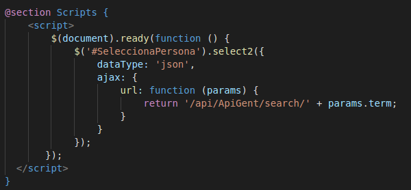
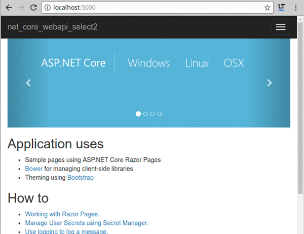

# net-core-webapi-select2
select2 and net core webapi integration

## [<< Visualitza els vídeos de la pràctica >>](https://uf.ctrl-alt-d.net/material/mostra/449/construccio-duna-webapi-restful-custom-api-amb-select2)


Artícles interessants:

### [Goodbye Web API: Your Guide to RESTful APIs with ASP.NET Core](https://stackify.com/asp-net-core-web-api-guide/)

>When ASP.NET Core was released, Microsoft and the .NET community decided to merge the functionality of MVC and Web API. This makes sense since the two have always been very similar. We went through the process of making an ASP.NET Core Web API with various scenarios and came up with these tips for anyone out there wanting to do the same. Are you looking to implement a Web API with ASP.NET Core? Here’s how to accomplish exactly that.

### [Scaffolding with ASP.Net](https://dev.to/andre2w/scaffolding-with-aspnet)

>One of the things that I really like in rails is tha hability to generate files using the scaffolding through the CLI, and recently I've started to learn ASP.Net Core.

### [ASP.NET Razor Pages vs MVC: How Do Razor Pages Fit in Your Toolbox?](https://stackify.com/asp-net-razor-pages-vs-mvc/)

>A Razor Page is very similar to the view component that ASP.NET MVC developers are used to. It has all the same syntax and functionality.
>The key difference is that the model and controller code is also included within the Razor Page itself. It is more an MVVM (Model-View-ViewModel) framework. It enables two-way data binding and a simpler development experience with isolated concerns.

### [Create a Web API with ASP.NET Core MVC and Visual Studio Code on Linux, macOS, and Windows](https://docs.microsoft.com/en-us/aspnet/core/tutorials/web-api-vsc)

>In this tutorial, build a web API for managing a list of "to-do" items. A UI isn't constructed.

### [ASP.NET Core Web API help pages using Swagger / Open API](https://docs.microsoft.com/en-us/aspnet/core/tutorials/web-api-help-pages-using-swagger)

>When consuming a Web API, understanding its various methods can be challenging for a developer. Swagger, also known as Open API, solves the problem of generating useful documentation and help pages for Web APIs. It provides benefits such as interactive documentation, client SDK generation, and API discoverability.

### Passes de la pràctica

Fem l'aplicació com a MVC razor:

```
mkdir net-core-webapi-select2
cd net-core-webapi-select2
dotnet new razor
```

Afegim paquet per assistent scaffolding:

```
dotnet add package Microsoft.AspNetCore.All -v 2.0.5
dotnet add package Microsoft.VisualStudio.Web.CodeGeneration.Design -v 2.0.2
dotnet add package Microsoft.VisualStudio.Web.CodeGeneration.Tools -v 2.0.2
dotnet restore
```

Amb compte amb el fitxer del projecte, després d'afegir els paquets s'ha de fixar:

```
<Project Sdk="Microsoft.NET.Sdk.Web">
  <PropertyGroup>
    <TargetFramework>netcoreapp2.0</TargetFramework>
  </PropertyGroup>
  <ItemGroup>
    <PackageReference Include="Microsoft.AspNetCore.All" Version="2.0.5" />
    <PackageReference Include="Microsoft.VisualStudio.Web.CodeGeneration.Design" Version="2.0.2" />
  </ItemGroup>
  <ItemGroup>
    <DotNetCliToolReference Include="Microsoft.VisualStudio.Web.CodeGeneration.Tools" Version="2.0.2" />
  </ItemGroup>
</Project>
```

Crear [model](./Models/Persona.cs) i [dbcontext](./Models/MyContext.cs).

Afegir paquest sqlite i entity framework:

```
dotnet add package Microsoft.EntityFrameworkCore.Sqlite
dotnet add package Microsoft.EntityFrameworkCore.Tools.DotNet
```

Ull! les Tools d'EF són un ```DotNetCliToolReference```.

Cal fer les migracions:

```
dotnet build
dotnet ef migrations add "Migracio Inicial"
dotnet ef database update
```

[Fem la pàgina Razor que ens crearà les persones](./Pages/AddRandomPeople.cshtml.cs). Amb Core el context el rebrem per paràmetre perquè així ho hem configurat a l' [Startup.cs](./Startup.cs)

Deixem que l'scaffolding ens crei el controller:

```
dotnet aspnet-codegenerator controller -name GentController -outDir Controllers -m Persona -dc MyContext
```

Següent pas, fer la Api. Afegir el [controlador de la API](./Controllers/ApiGentController.cs). Generem el controlador amb l'opció `-api`:

```
dotnet aspnet-codegenerator controller -name ApiGentController -outDir Controllers -m Persona -dc MyContext -api
```

Ara anem a [instal·lar select2](https://select2.org/getting-started/installation), ho posem a les [dependències de client (bower.json)](./bower.json) i executem ```dotnet restore```. Comprovem
que les dependències de client no s'actualitzen soles. Posem select2 mitjançant CDN de cloudflare.
Cal anar amb compte perquè hi ha dos entorns (include/exclude="Development") i cal posar-lo a tots dos.

Ara només falta crear la API per tal de fer servir [select2 amb ajax](https://select2.org/data-sources/ajax).

Es fa d'aquesta manera:







